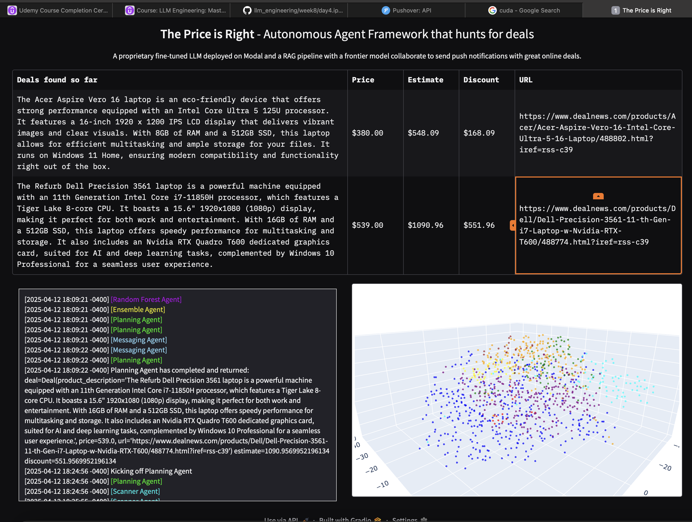

# DealMind: An Agentic AI Framework for Smart Deal Discovery

**DealMind** is a modular multi-agent system that autonomously discovers and evaluates the best online deals using a blend of LLMs, traditional machine learning, and Retrieval-Augmented Generation (RAG). The system scrapes product listings from DealNews RSS feeds, analyzes product descriptions through multiple agents, and estimates fair value using OpenAI models, a LoRA fine-tuned LLaMA, and traditional regressors. These predictions are aggregated by an ensemble model and filtered to identify top discount opportunities, which are then sent to the user via Pushover notifications. A Gradio-based dashboard provides live visibility into system outputs, agent logs, and embedding visualizations.

## Deal Sources

The system monitors deals from the following categories:

- https://www.dealnews.com/c142/Electronics/?rss=1  
- https://www.dealnews.com/c39/Computers/?rss=1  
- https://www.dealnews.com/c238/Automotive/?rss=1  
- https://www.dealnews.com/f1912/Smart-Home/?rss=1  
- https://www.dealnews.com/c196/Home-Garden/?rss=1  

## Agent Framework

Seven intelligent agents collaborate to analyze and rank deals:

1. **FrontierAgent** – Uses OpenAI LLMs and a RAG pipeline (with Hugging Face datasets) to estimate fair market value from similar items.
2. **PriceAgent** – Predicts prices using a LoRA fine-tuned LLaMA model.
3. **RandomForestAgent** – Applies a trained Random Forest regressor for numeric estimation.
4. **LinearRegressionAgent** – Provides a linear price estimate as a baseline.
5. **EnsembleAgent** – Aggregates outputs from all predictive agents.
6. **PlanningAgent** – Filters the most valuable deals based on estimated discount.
7. **MessagingAgent** – Sends push notifications to users via the Pushover API.

## Technologies Used

- Python 3.11
- Hugging Face Transformers and Datasets
- OpenAI GPT models via API
- LoRA fine-tuned LLaMA
- Retrieval-Augmented Generation (RAG)
- Scikit-learn (Random Forest, Linear Regression)
- Gradio for dashboard UI
- Pushover for deal notifications

## Setup

### 1. Clone the Repository

```bash
git clone https://github.com/yourusername/dealmind.git
cd dealmind
```

### 2. Create and Activate the Conda Environment

```bash
conda env create -f environment.yml
conda activate llms
```

### 3. Set Environment Variables

Create a `.env` file in the root directory with the following content:

```env
OPENAI_API_KEY=your_openai_key
HUGGINGFACE_API_KEY=your_hf_token
PUSHOVER_USER=your_pushover_user_key
PUSHOVER_TOKEN=your_pushover_app_token
```

## Running the System

Launch the full multi-agent pipeline using:

```bash
python main.py
```

## Sample Output

Below is an example of the Gradio dashboard with deal results and 3D embedding visualization:



## License

MIT License

## Author

Amirhossein Ghadami  
[LinkedIn](https://www.linkedin.com/in/amirhosseinghadami)  
[GitHub](https://github.com/amirgadami)